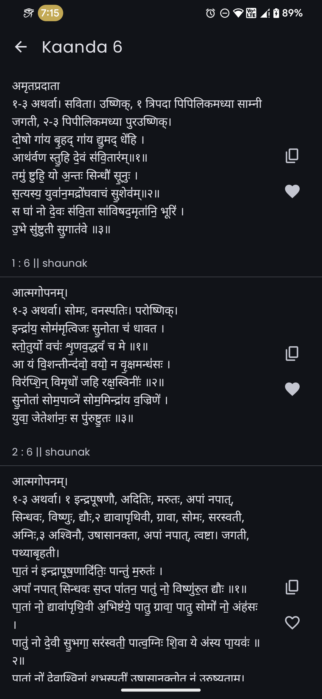
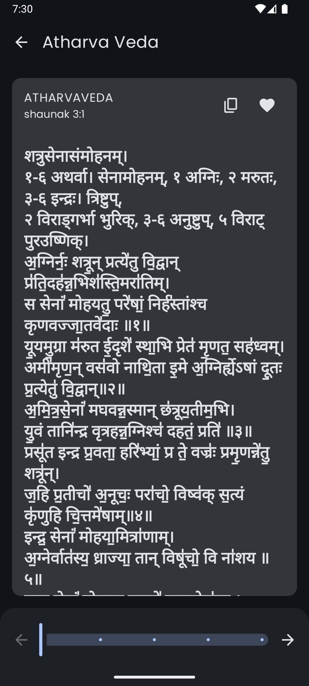
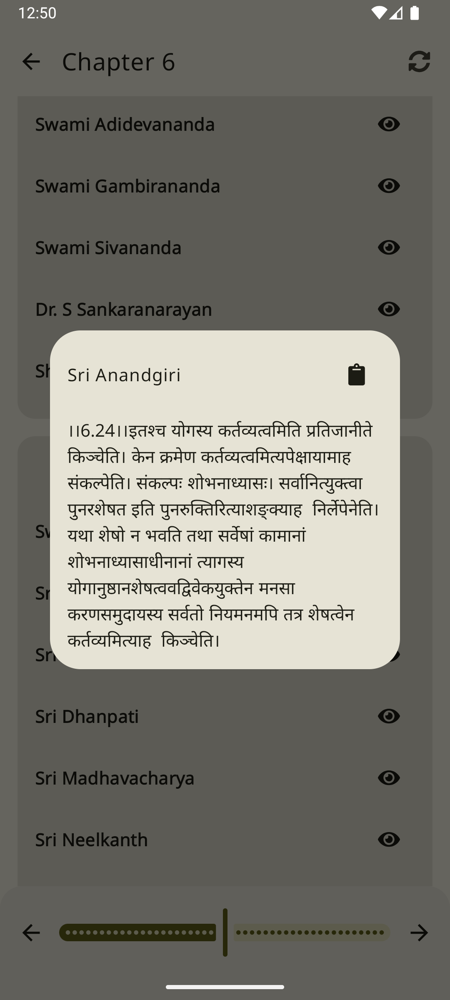

# Dharmik

### Browse Bhagavad Gita

> 
> 
> 

> ### Android
> 
> 
> 
> ### or latest [Github Release](https://github.com/shub39/Dharmik/releases)

### Screenshots
|  |  |
|:------------------------------------------------------------------:|:------------------------------------------------------------------:|
|  |  |

### Features
- Completely offline with no sketchy permissions or ads
- View verses, commentaries and translations for over 2000 verses
- Audio transcriptions in three languages (english, hindi and sanskrit)
- Copy verses, commentaries and translations to clipboard

### Thanks to
> - [Dharmic Data](https://github.com/bhavykhatri/DharmicData) for the texts
> - [Gita Supersite](https://www.gitasupersite.iitk.ac.in/) for audio