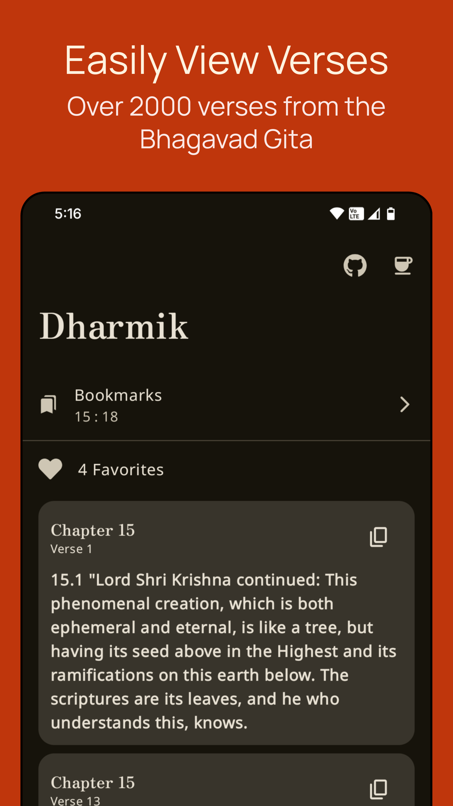
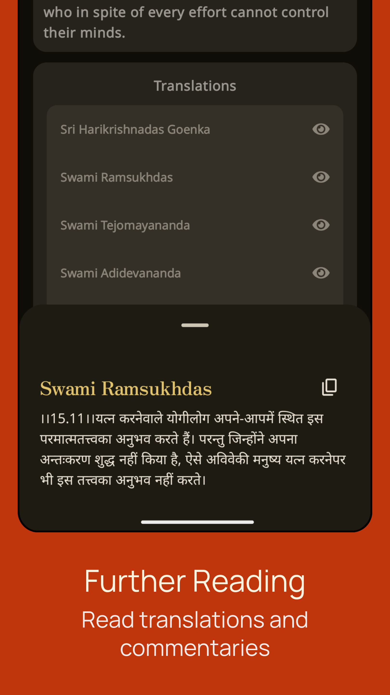

# Dharmik
### Browse Bhagavad Gita

> 
> 
> 

> ### Stats and Socials
> 
> 
> 

> ### Get On
> 
> 
> 
> 
> ### or Download latest from [Releases](https://github.com/shub39/Dharmik/releases)

## Screenshots 📱
|  |  |
|:------------------------------------------------------------------:|:------------------------------------------------------------------:|
|  |  |

## Features ✨
>- No sketchy permissions or ads
>- View verses, commentaries and translations for over 2000 verses
>- Audio transcriptions in three languages (english, hindi and sanskrit)
>- Copy verses, commentaries and translations to clipboard

## Motivation 💭
I built this for my parents. Also as an effort to fight misinformation online regarding this book. There are way too many 
bad actors and self-proclaimed "Gurus" online that misinterpret verses to fit their own agenda. This should help skeptics
to fact check verses and translations with original interpretations from various spiritual leaders. Also Gita Supersite's
UI is extremely outdated and not user friendly

## References and Inspiration 💡
>- [Dharmic Data](https://github.com/bhavykhatri/DharmicData) for the texts
>- [Gita Supersite](https://www.gitasupersite.iitk.ac.in/), primary source and audio for the verses

## Stargazers over time ✨
