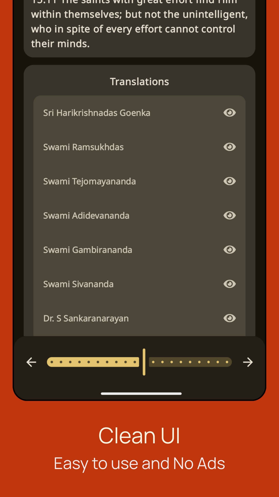

# Dharmik

### A Compose Multiplatform app to browse Hindu Texts. 🚧 Currently under construction 🚧

> ### Platforms
> 
> 
> 
> 

> ### Made With
> 
> 

### Screenshots
|  |  |  |  |
|:-------------------------------------------------------------------:|:-------------------------------------------------------------------:|:-------------------------------------------------------------------:|:-------------------------------------------------------------------:|

### Check List
> - [x] ~~Setup project (themes, libraries, etc)~~
> - [ ] Add Share as Cards feature (if possible)
> - [ ] Add translator (if possible)
> - [x] ~~Add Atharvaveda~~
> - [ ] Add Ramcharitmanas
> - [ ] Add Srimad Bhagavad Gita
> - [ ] Add Mahabharata
> - [ ] Add Valmiki Ramayana
> - [ ] Add Rigveda
> - [ ] Add Yajurveda Shukla

### Thanks to
> - [Dharmic Data](https://github.com/bhavykhatri/DharmicData) for the texts